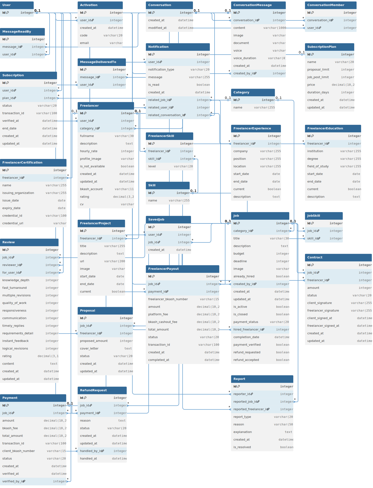
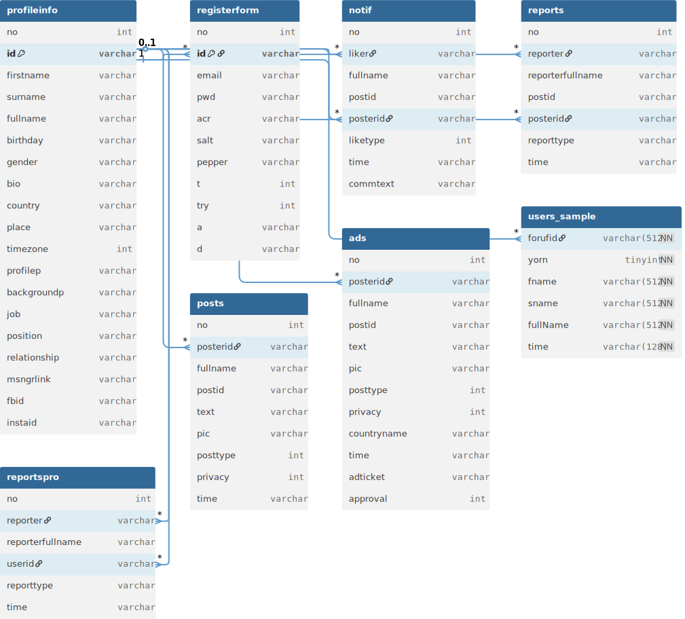
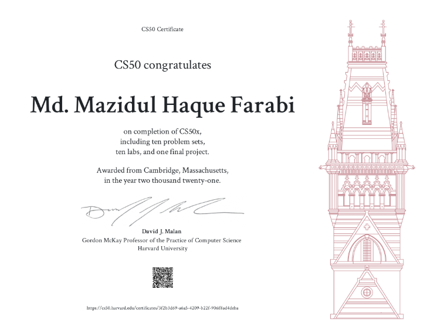
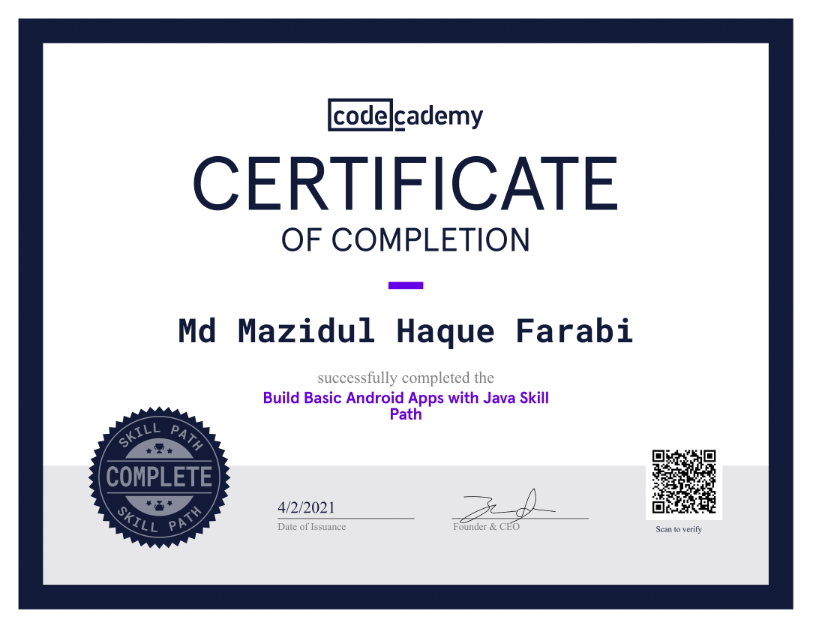
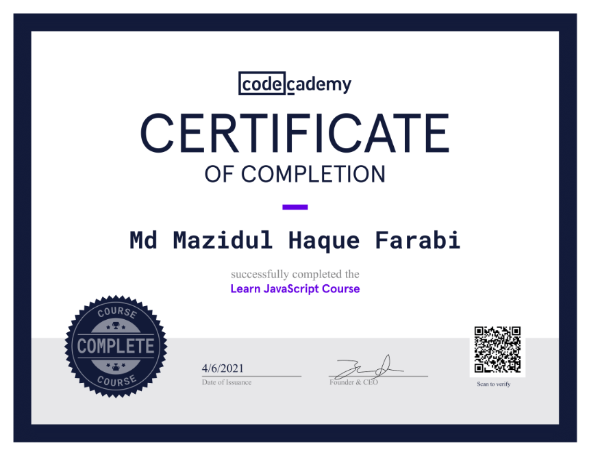
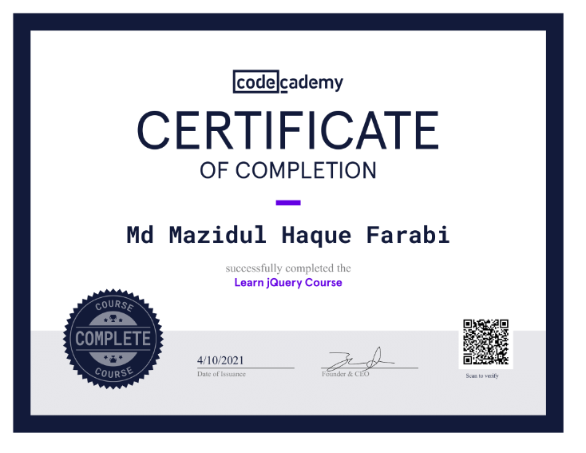

# <div align="center">**Md. Mazidul Haque Farabi**</div>

<div align="center">
  
### **Full Stack Web Developer** | **Python-Django** | **Java**

<br>

**Coding Since 2017 | 8 Long Years Has Taught Me to Be More & More Patient**

---

<br>

[](https://github.com/mazidulfarabi)
[](https://github.com/mazidulfarabi)
[](https://github.com/mazidulfarabi)

</div>

---

## **About Me**

```typescript
const developer = {
    name: "Md. Mazidul Haque Farabi",
    role: "Full Stack Web Developer",
    experience: "8+ Years",
    passion: "Building scalable, responsive web applications",
    specialty: ["Python-Django", "React.js", "Java", "Backend Engineering"],
    currentFocus: ["Cloud Deployments with AWS/GCP/OCI", "CI/CD pipelines", "DevOps tools"],
    askMeAbout: ["Django", "React", "Full-stack architecture"]
};
```

> I'm a passionate developer who loves building scalable, responsive web applications and solving real-world problems through code. I specialize in Python-Django, React.js, Java, and backend engineering. Currently exploring Cloud Deployments with AWS/GCP/OCI, CI/CD pipelines, and DevOps tools. Ask me about anything Django, React, or full-stack architecture.

---

<details open>
<summary><h2><strong>Tech Stack Arsenal</strong></h2></summary>

<br>

### **Languages**


### **Frameworks & Libraries**


### **Databases**


### **Cloud & DevOps**


### **IDEs & Software**


</details>

---

<details open>
<summary><h2><strong>GitHub Analytics</strong></h2></summary>

<br>

<div align="center">


</div>

---

<details open>
<summary><h2><strong>Achievement Showcase</strong></h2></summary>


<div align="center">


</div>

</details>

---

<details open>
<summary><h2><strong>Featured Projects</strong></h2></summary>

<br>

### **[Kormo – Work From Home, Hire From Home](https://kormo.work)**
> Django-based job marketplace with modular multi-app structure, user dashboards, and secure subscription tiers.

<div align="center">

[](https://kormo.work)
[](https://play.google.com/store/apps/details?id=co.median.android.kbydjp)
[](https://github.com/thynkzone/Kormo-Freelance)

</div>

<details open>
<summary><strong>App Screenshots</strong></summary>

<br>

<div align="center">


</div>

</details>

<details>
<summary><strong>Project Overview</strong></summary>

<br>

| **Metric** | **Value** |
|------------|-----------|
| **Total Lines of Code** | 20,430 |
| **Total Custom Files** | 185 |

| **File Type** | **Lines of Code** | **File Count** |
|---------------|-------------------|----------------|
| Python (.py) | 7,431 | 116 files |
| HTML Templates | 12,808 | 62 files |
| CSS (.css) | 121 | 3 files |
| JavaScript (.js) | 70 | 4 files |

**Architecture Components:**
- **Django Backend** with extensive models, views, forms, and business logic
- **Dynamic HTML Templates** with complex layouts and conditional rendering
- **Minimal Custom Styling** using Bootstrap and Tailwind
- **Lightweight JavaScript** to support client-side functionality

</details>

<details>
<summary><strong>Database Schema (DBML)</strong></summary>
<br>
<div align="center">

</div>
</details>

<details>
<summary><strong>Architecture & Technology Stack</strong></summary>

<br>

### **Backend Framework**
- Django 5.2.4 – Main web framework
- Python – Programming language
- SQLite – Lightweight database (development mode)
- Django ORM – ORM for database abstraction

### **Frontend Technologies**
- Bootstrap 5.3.0 – CSS framework
- Tailwind CSS – Utility-first styling
- Font Awesome 6.7.2 – Icon library
- Vanilla JavaScript – Lightweight client scripting

### **Third-Party Integrations**
- `django-allauth` – Authentication and user management
- Google OAuth 2.0 – Social login
- `django-recaptcha` & `django-simple-captcha` – Form protection
- Pillow – Image handling and validation
- PyJWT – Token-based authentication
- Brevo SMTP – Email delivery service

</details>

<details>
<summary><strong>Data Structures & Models</strong></summary>

<br>

### **Core Models**
- **User Management:** `accounts/models.py` – Custom user model, authentication, and profile data
- **Job System:** `job/models.py` – Jobs, budgets, deadlines, and skill tags
- **Freelancer System:** `freelancer/models.py` – Proposals, ratings, contracts
- **Communication:** `conversation/models.py` – Messaging and conversations
- **Dashboard:** `dashboard/models.py` – User dashboard metrics and status

</details>

<details>
<summary><strong>Algorithms & Data Processing</strong></summary>

<br>

### **Search & Filtering Algorithms**
- Multi-criteria search using Django Q objects
- Category, skill, rating, and budget-based filtering
- Sorting by rating, date, budget, name, and proposal count
- Paginated results (20 per page) with dynamic navigation

### **Rating Calculation Algorithm**
- Aggregated multi-criteria review scores
- Bi-directional review system (freelancer ↔ client)

### **File Processing Algorithms**
- Image size/type/dimension validation
- Audio file support and processing
- PDF/document upload validation

</details>

<details>
<summary><strong>Security Features</strong></summary>

<br>

### **Authentication & Authorization**
- Email-based account activation and password reset
- Social authentication (Google OAuth 2.0)
- JWT support for secure session handling

### **Session & Token Management**
- Secure sessions with expiration
- Remember me functionality
- CSRF token on every form

### **Input Validation**
- File type, size, and dimension validation
- Audio format restrictions (MP3, WAV, OGG, M4A)
- URL validation with regex and protocol/domain checks
- reCAPTCHA and CAPTCHA integrations

### **Rate Limiting & Protection**
- Max 5 failed login attempts/day
- Account lockout mechanisms
- XSS, CSRF, and clickjacking protection

### **Data Protection**
- Strong password policies and validators
- TLS encryption for email
- Secure SMTP and email verification

</details>

<details>
<summary><strong>Internationalization & Localization</strong></summary>

<br>

### **Supported Languages**
- English (en)
- Russian (ru)
- Simplified Chinese (zh-Hans)
- French (fr)
- Spanish (es)
- Bangla (bn)

### **Localization Features**
- Timezone support (Asia/Dhaka)
- Localized currency/date/time formatting
- Translation-ready message system

</details>

<details>
<summary><strong>User Experience Features</strong></summary>

<br>

### **Real-time Features**
- Message read/unread tracking
- Real-time chat updates
- Delivery status tracking

### **Responsive Design**
- Mobile-first layout
- Bootstrap grid + Tailwind utility classes
- Progressive enhancement for compatibility

### **Performance Optimizations**
- `select_related` query optimization
- Pagination for heavy views
- Image and static file optimization
- CDN integration for external assets

</details>

<details>
<summary><strong>Business Logic</strong></summary>

<br>

### **Freelancing Platform Features**

**Job Management**
- Job posting with title, description, deadline, and budget
- Budget range: 300–9999 BDT
- Skill-tagging and deadline enforcement

**Proposal System**
- Freelancers submit proposals with cover letters
- Clients can shortlist, message, and track proposal status

**Contract Management**
- Digital contract acceptance system
- Payment milestone tracking and status updates

**Payment System**
- bKash integration with transaction verification
- Refunds and platform fee deductions
- Secure and transparent fund flow

**Review System**
- Client and freelancer rating submission
- Aggregated scores with multiple criteria

**Subscription Plans**
- Free, Member, and Pro plans
- Feature-based access control
- Expiration and renewal handling with payment verification

</details>

---

### **[P&C (People & Culture) – Social Network for Workplaces](https://thynkzone.eu.org)**
> Java web app for workplace engagement, featuring social interaction and secure user management.

<div align="center">

[](https://thynkzone.eu.org)
[](https://play.google.com/store/apps/details?id=io.kodular.detectivemailofficial.Thynkzone)
[](https://github.com/thynkzone/PnC-Social)

</div>

<details open>
<summary><strong>App Screenshots</strong></summary>

<br>

<div align="center">


</div>

</details>

<details>
<summary><strong>Project Overview (P&C)</strong></summary>

<br>

A comprehensive full-stack workplace social networking platform built for organizational communities. The platform is a substantial, enterprise-level application with:

| **Metric** | **Value** |
|------------|-----------|
| **Total Lines of Code** | 42,500+ |
| **JSP Pages** | 63 |
| **Java Classes** | 27 |
| **Java Backend** | ~4,772 lines |
| **JSP Frontend** | ~35,000 lines |
| **CSS Styling** | 1,699 lines |
| **JavaScript** | ~500 lines |
| **Main Database Class** | 3,272 lines |

Multiple database tables and complex business logic

It functions as a complete internal social media solution with robust features, high security, and a modern user experience.

</details>

<details>
<summary><strong>Database Schema (DBML)</strong></summary>
<br>
<div align="center">

</div>
</details>

<details>
<summary><strong>Technical Architecture & Implementation</strong></summary>

<br>

### **Backend Development (Java/JSP)**

**Core Database Layer**
Implemented 3,272+ lines of database operations in `db.java` with 50+ methods handling user authentication, session management, and persistent storage.

**Security Framework**
Integrated multi-layered security, including BCrypt password hashing, SHA-512 encryption, CSRF protection, and secure cookie handling.

**Authentication System**
Custom session management using encrypted cookies, secure login/logout flow, and role-based user validation.

**Data Management**
Designed 8+ normalized tables (`registerform`, `profileinfo`, `posts`, `ads`, `notif`, `reports`, etc.) with complex relational mapping and dynamic user-specific table creation.

**Utility Classes**
Built 27 specialized Java classes including:
- `encdecry.java` for encryption
- `hasher.java` for hashing
- `imgtype.java` for image validation
- `Mailer.java` for email communication

### **Frontend Development**

**Responsive UI**
Developed 63 JSP pages using 1,699+ lines of custom CSS with CSS Grid, Flexbox, and CSS Variables for modern, mobile-first design.

**Interactive Features**
Real-time posting, commenting, and notification system with jQuery for dynamic content updates.

**User Experience Enhancements**
Dark/light mode toggle, tabbed interfaces, modern navigation, and accessibility-compliant components.

**Component Library**
Created reusable UI elements such as cards, forms, dropdowns, and modals.

</details>

<details>
<summary><strong>Key Features</strong></summary>

<br>

**User Management**
Registration, profile editing, friend/follower system, and privacy settings.

**Content System**
Post creation (images, text, memes), commenting, reactions, and image uploads.

**Gamification**
Engagement-based point system with 9 user ranks (Novice to Chief), achievement tracking.

**Social Features**
Real-time notifications, user search/discovery, and connection management.

**Administrative Tools**
Content moderation, user reporting system, ad management, and analytics dashboard.

**Security Features**
Comprehensive input validation, XSS and SQL injection protection, secure file upload handling.

</details>

<details>
<summary><strong>Database Design</strong></summary>

<br>

**Multi-Database Architecture**
Separated databases for user data (`thynkzone`) and relational data (`users`).

**Dynamic Schema**
User-specific tables are generated on registration for personalized data handling.

**Optimized Queries**
Used prepared statements, connection pooling, and efficient SQL query patterns.

**Data Integrity**
Implemented foreign key constraints, transaction management, and thorough data validation.

</details>

<details>
<summary><strong>Technologies Used</strong></summary>

<br>

**Backend:** Java, JSP, Servlets, JDBC, MySQL, BCrypt, SHA-512
**Frontend:** HTML5, CSS3, JavaScript, jQuery, FontAwesome, Google Fonts
**Security:** CSRF tokens, encrypted cookies, input sanitization, reCAPTCHA
**Deployment:** Apache Tomcat, Linux server environment

</details>

<details>
<summary><strong>Performance & Scalability</strong></summary>

<br>

- Database connection pooling and prepared statements for optimal efficiency
- Optimized file and image processing during uploads
- Responsive layouts for cross-device support
- Modular and maintainable architecture for long-term scalability

</details>

<details>
<summary><strong>Data Structures & Algorithms in the P&C Application</strong></summary>

<br>

### **1. Data Structures Implemented**

**HashSet**
- **Purpose:** Prevents duplicates and allows efficient lookup for user connections
- **Usage:** Applied in 6+ JSP files for managing user lists, friend requests, and search results
- **Example:** `HashSet<String> mylist = new HashSet<String>()`
- **Applications:**
  - User search results deduplication
  - Friend/follower list management
  - Hidden posts tracking
  - Report management

**LinkedHashMap**
- **Purpose:** Maintains ordered key-value pairs
- **Usage:** Used in `reCaptchaV3.java` and `reCaptchaV2.java` for API request parameters
- **Example:** `LinkedHashMap<Object, Object> params = new LinkedHashMap<>()`
- **Applications:** Ensures parameter order during HTTP API communication

**StringBuilder**
- **Purpose:** Efficient string concatenation and manipulation
- **Usage:** Used in multiple classes for building dynamic strings
- **Applications:**
  - Random string generation (`Rancook.java`)
  - HTTP request building (`reCaptchaV3.java`)
  - Image filename construction

**Array (String[])**
- **Purpose:** Fixed-size data structures for returning multiple values
- **Usage:** Returning profile details and query results
- **Applications:**
  - User profile info aggregation
  - Structured database response handling

### **2. Algorithms Implemented**

**Hashing Algorithms**
- **SHA-512:** 15-round hashing for strong password security
- **SHA-1:** Lightweight hashing for CSRF tokens and temporary data
- **BCrypt:** Salted, secure password hashing
- **Custom Salt/Pepper:** Layered hashing using concatenated static/dynamic salts

**Cryptographic Algorithms**
- **AES Encryption:** 256-bit AES in CBC mode with PKCS5 padding
- **PBKDF2:** 35,072 iterations for key derivation
- **SecureRandom:** Cryptographically secure random number generation

**String Manipulation Algorithms**
- Substring parsing
- Efficient concatenation with `StringBuilder`
- Regex-based pattern matching for input sanitization

**Number Formatting Algorithm**
- **Logarithmic Scaling:** Implemented in `millionaize.java` for display formatting (e.g., 1.2k, 1.5M)
- **Formula:** `exp = log(number) / log(1000)`

**Random Generation Algorithms**
- 128-character secure random strings
- UUID generation for posts and user IDs
- Custom character sets for different contexts (e.g., verification tokens)

**Database Query Algorithms**
- Prepared statement optimization
- Iterative result set parsing
- JDBC connection pooling

**Image Processing Algorithms**
- Dynamic image resizing
- File type and format detection
- Automatic EXIF-based orientation correction

**Search and Filter Algorithms**
- Deduplicated user search
- Content filtering based on privacy settings
- Relationship mapping for user connectivity

### **3. Algorithmic Complexity**

**Time Complexity**
- `HashSet` operations: O(1) on average for `add()` and `contains()`
- String manipulation: O(n) for concatenation and parsing
- Database queries: Optimized with indexing and prepared statements
- Iterative hashing (SHA-512): O(n)

**Space Complexity**
- `HashSet`: O(n) for n unique elements
- `StringBuilder`: O(n) for n characters
- Result sets: Managed using streaming and memory-efficient parsing

### **4. Security Algorithms**

**Input Validation Algorithms**
- String length enforcement
- Calendar-based date validation
- Range checks for numeric input

**Token Generation & Verification**
- CSRF token: Combines secure random number with hash
- Session token: Encrypted, stored in secure cookies
- Expiry validation and token authenticity checks

### **5. Performance Optimizations**

**Caching Strategies**
- JDBC connection pooling
- Efficient `ResultSet` usage
- Manual garbage collection and object reuse

**Query Optimization**
- Use of parameterized prepared statements
- Query indexes for fast lookup
- Batch operations for bulk insert/update efficiency

</details>

</details>

---

<details>
<summary><h2><strong>Certifications</strong></h2></summary>

<br>

<div align="center">

<table>
<tr>
<td align="center">

<br><strong>Certificate 1</strong>
</td>
<td align="center">

<br><strong>Certificate 2</strong>
</td>
<td align="center">

<br><strong>Certificate 3</strong>
</td>
</tr>
<tr>
<td align="center">

<br><strong>Certificate 4</strong>
</td>
<td align="center">

<br><strong>Certificate 5</strong>
</td>
<td align="center">

<br><strong>Certificate 6</strong>
</td>
</tr>
<tr>
<td align="center">

<br><strong>Certificate 7</strong>
</td>
<td align="center">

<br><strong>Certificate 8</strong>
</td>
<td align="center">

<br><strong>Certificate 9</strong>
</td>
</tr>
</table>

</div>

</details>

---

## **Connect With Me**

<div align="center">

<a href="mailto:mazidul.farabi@gmail.com">
  
</a>
<a href="https://linkedin.com/in/mazidulfarabi">
  
</a>
<a href="https://mazidulfarabi.netlify.app">
  
</a>
<a href="https://github.com/thynkzone">
  
</a>

</div>

---

<div align="center">

### **Visitor Counter**


---

### **Fun Fact**
> *I write clean, scalable code and enjoy debugging as much as building.*  
> *When I'm not coding, I'm probably mentoring, reading tech blogs, or brainstorming startup ideas.*

</div>

---

<div align="center">

**Made with ❤️ by [Mazidul Farabi](https://github.com/mazidulfarabi)**

</div>
